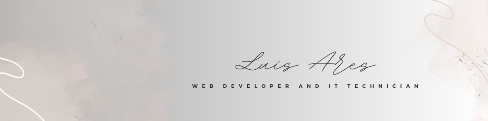

  

**Bienvenido a mi repositorio de proyectos donde comparto mis soluciones a desafíos y otras aplicaciones que he desarrollado.**

## Sobre mí

- **Ubicación**: Fene, España 🌍  
- **Correo Electrónico**: [luisaap.dev@gmail.com](mailto:luisaap.dev@gmail.com) 📧  
- **Sitio Web**: [luisaap.es](https://luisaap.es/) 🌐    
- **GitHub**: [github.com/luisaap-dev](https://github.com/luisaap-dev) 👤  

## Experiencia Laboral

- **Programador Web** - Informática de Empresa ATIE, SL. (2024)  
- **Programador Web** - Plus42 (2023)  
- **Técnico Informático** - Freelance (2012 – 2017)  
- **Técnico Informático** - Informática de Empresa ATIE, SL. (2011)  

## Educación

- **Técnico Superior en Desarrollo de Aplicaciones Web** | (2024)  
- **IFCD0210 - Desarrollo de Aplicaciones con Tecnología Web** | (2023)  
- **Técnico en Sistemas Microinformáticos y Redes** | (2012)  

## Competencias Técnicas

### Lenguajes de Marca y  Programación

  
  
  
  
  

### Bases de Datos

  
  

### Frameworks y Librerías

  
  
  
  

### Estilos y Diseño

  
  
  

## Proyectos

  Explora mis proyectos y siéntete libre de dejar comentarios o sugerencias. Puedes ver todos mis proyectos en mi perfil de GitHub: (https://github.com/luisaap-dev) 📂

